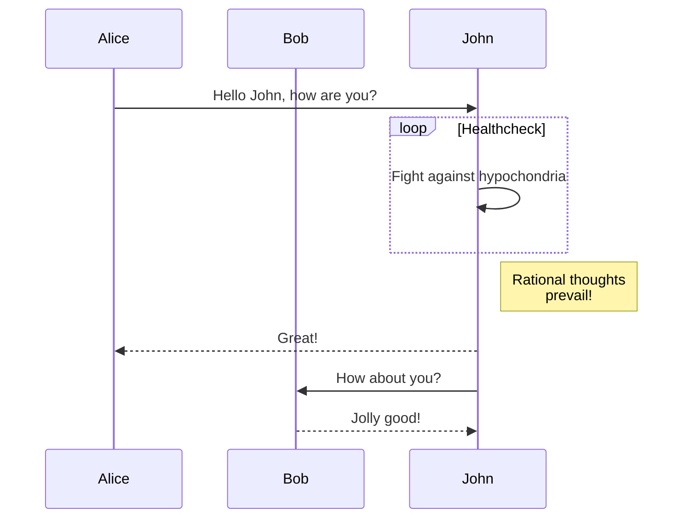

- [x] Write math example
    - [x] Write diagram example
- [ ] Do something else

```math
When $a \ne 0$, there are two solutions to $(ax^2 + bx + c = 0)$ and they are  $$ x = {-b \pm \sqrt{b^2-4ac} \over 2a} $$


When \(a \ne 0\), there are two solutions to \(ax^2 + bx + c = 0\) and they are \[x = {-b \pm \sqrt{b^2-4ac} \over 2a}.\]


When $a \ne 0$, there are two solutions to $(ax^2 + bx + c = 0)$ and they are  $$ x = {-b \pm \sqrt{b^2-4ac} \over 2a} $$


$$
\frac{1}{\Bigl(\sqrt{\phi \sqrt{5}}-\phi\Bigr) e^{\frac25 \pi}} \equiv 1+\frac{e^{-2\pi}} {1+\frac{e^{-4\pi}} {1+\frac{e^{-6\pi}} {1+\frac{e^{-8\pi}} {1+\cdots} } } }
$$

When \(a \ne 0\), there are two solutions to \(ax^2 + bx + c = 0\) and they are \[x = {-b \pm \sqrt{b^2-4ac} \over 2a}.\]


$$
\mathbf{V}_1 \times \mathbf{V}_2 = \begin{vmatrix} \mathbf{i} & \mathbf{j} & \mathbf{k} \\\\ \frac{\partial X}{\partial u} & \frac{\partial Y}{\partial u} & 0 \\\\ \frac{\partial X}{\partial v} & \frac{\partial Y}{\partial v} & 0 \end{vmatrix}
$$


When \(a \ne 0\), there are two solutions to \(ax^2 + bx + c = 0\) and they are \[x = {-b \pm \sqrt{b^2-4ac} \over 2a}.\]
```

