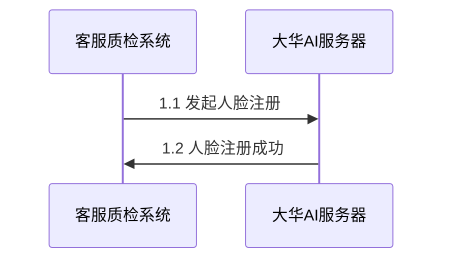
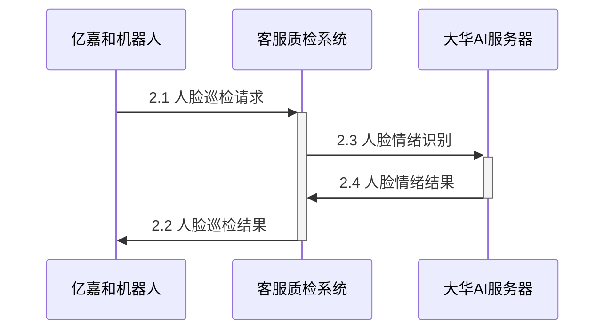

## 用户开户注册流程



### 发起人脸注册
需大华AI文档明确

### 人脸注册成功
需大华AI文档明确

## 巡检流程



### 人脸巡检请求（待协商）
由亿嘉和机器人发起的对客服质检系统的基于**HTTP Post**的接口调用。
- **URL**: /api/face-inspection
- **Method**: POST
- **Body**: 参见下面json格式

```json
{
  "s_id": "123", // 测点id
  "temperature": 36.5, // 表示温度
  "image": "XXXXXX"  // base64编码的人脸jpg图片 
}
```

### 人脸巡检结果（待协商）

```json
{
  "code": "0000", // 巡检成功返回0000, 失败返回其他数值
  "message": "成功" // 巡检成功返回”成功“，失败返回失败原因
}
```

### 人脸情绪识别
需大华AI文档明确

### 人脸情绪结果
需大华AI文档明确

