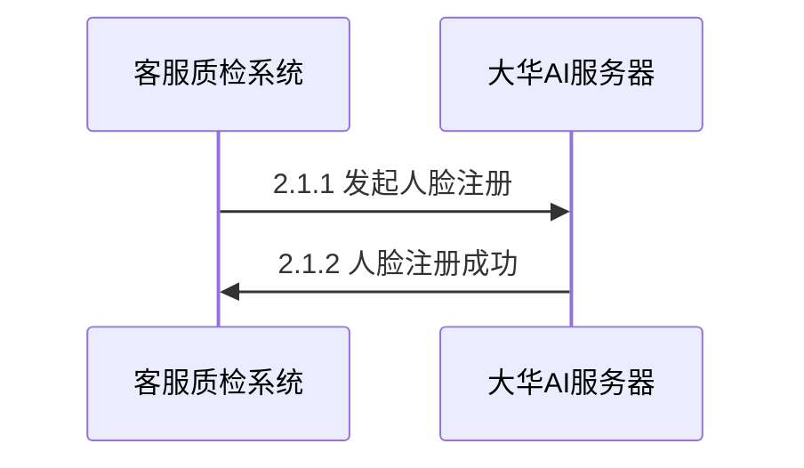
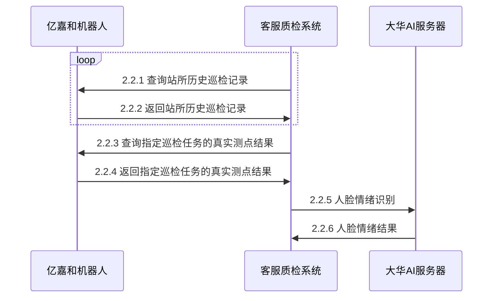

<h1>情绪质检系统方案说明</h1>

## 总体流程
- 亿嘉和实施工程师A200挂轨机器人的安装和巡检点设置
- 每个工位设置两个巡检点，并根据客户要求设置好巡检任务的定期触发周期
- 将所有客服人员的基本信息和个人头像照片录入到客服质检系统中进行人员信息录入
- 客服质检系统每2秒轮寻A200服务器的《查询站所历史巡检记录》,检查是否有新的质检任务被触发
- 检测到新的质检任务被触发后，通过任务id，调用A200服务器的《查询指定巡检任务的真实测点结果》，将该工位的测点1上拿到的可见光图片和测点2上拿到的温度数据读取出来
- 使用测点一的可见光图片，调用大华AI服务器，获取该人脸的工号信息和情绪

## 接口与时序图

### 用户开户注册流程

#### 发起人脸注册
需大华AI提供接口

#### 人脸注册成功
需大华AI提供接口

### 巡检流程

#### 查询站所历史巡检记录
请亿嘉和提供

#### 返回站所历史巡检记录
请亿嘉和提供

`注：需要提供任务状态的枚举值含义`

#### 查询指定巡检任务的真实测点结果
请亿嘉和提供

#### 返回指定巡检任务的真实测点结果
请亿嘉和提供

`注：需要提供温度的读取方式`

#### 人脸情绪识别
需大华AI提供接口

#### 人脸情绪结果
需大华AI提供接口
